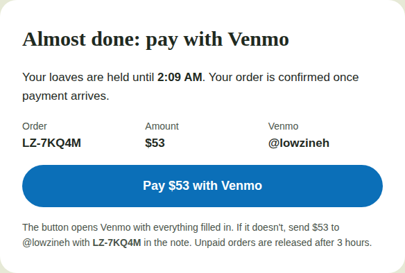
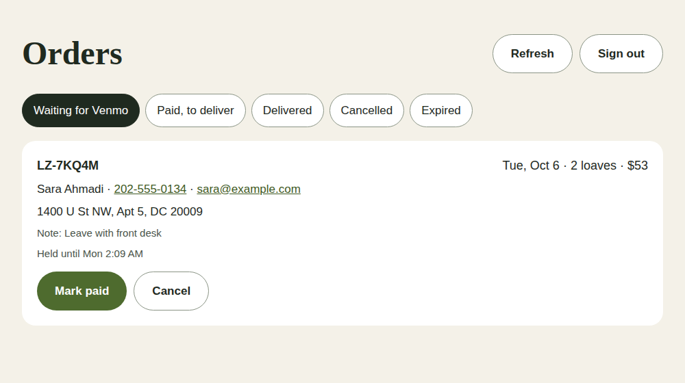
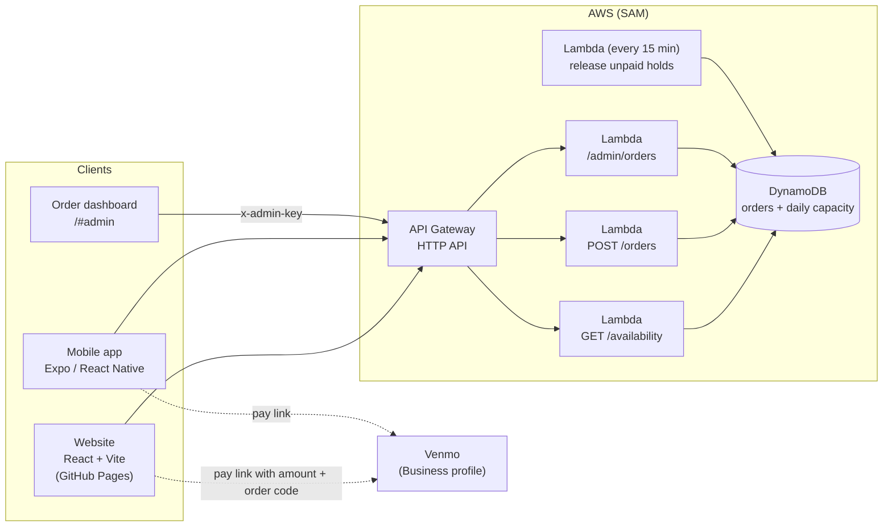
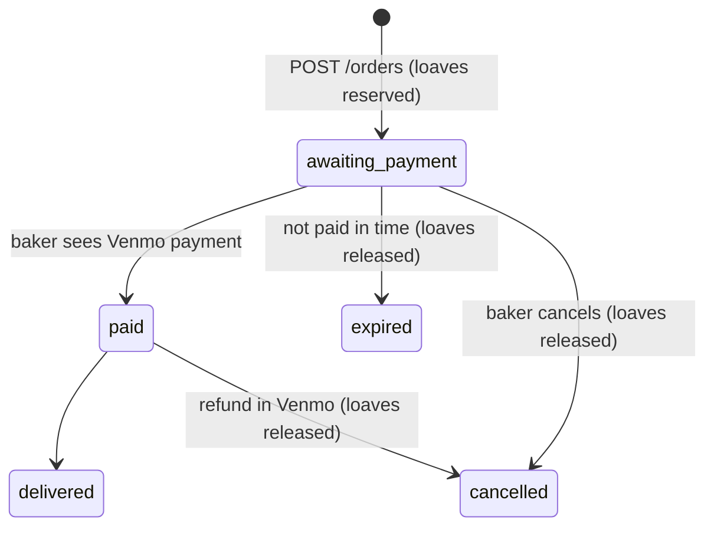

# Lowzineh

Online ordering for **Lowzineh**, a single-product home bakery in Washington, DC: a pistachio-cardamom upside-down loaf made with almond flour and honey, named after *lowzineh* (لوزینه), the Persian almond sweet.

**Live site:** [aylarba.github.io/pistachio-loaf](https://aylarba.github.io/pistachio-loaf/) &nbsp;|&nbsp; **Instagram:** [@lowzineh](https://instagram.com/lowzineh)

<p>
  
  &nbsp;
  
</p>

## What it does

- Customers choose a delivery date, quantity, and DC address, then pay with **Venmo**. The site opens Venmo with the amount and a short order code (e.g. `LZ-7KQ4M`) already filled in.
- The API enforces a **daily baking capacity** with an atomic DynamoDB counter, so a day can't be oversold even if two people order at once.
- Unpaid orders **hold their loaves for a few hours**. A scheduled Lambda releases them automatically if payment never arrives.
- A private **order dashboard** (`/#admin`, protected by an admin key) lists orders by status. The baker marks them paid when the Venmo payment shows up, then delivered.
- Delivery is validated to **Washington, DC ZIP codes** to match the DC cottage food permit.
- The website is an installable PWA, deployed to GitHub Pages by GitHub Actions. An Expo app shares the same API.

<p>
  
  &nbsp;
  
</p>

## Architecture



### Order lifecycle



All status changes are conditional writes, so a double click or a retry can't apply the same change twice or release loaves twice.

### Data model (single DynamoDB table + one GSI)

| PK | SK | GSI1PK | GSI1SK | Attributes |
|---|---|---|---|---|
| `DAY#2026-10-10` | `CAPACITY` | | | `booked` |
| `ORDER#LZ-7KQ4M` | `ORDER` | `STATUS#awaiting_payment` | expiry time | customer, date, quantity, address, total, status |
| `ORDER#LZ-7KQ4M` | `ORDER` | `STATUS#paid` | `2026-10-10#LZ-7KQ4M` | (same item after it's paid) |

GSI1 serves both the dashboard ("all paid orders, by delivery date") and the expiry job ("unpaid orders whose hold has passed").

## Tech stack

| Layer | Tools |
|---|---|
| Frontend | React 19, Vite, plain CSS, PWA manifest |
| Mobile | Expo, React Native |
| Backend | Node.js 24 on AWS Lambda (arm64), API Gateway HTTP API, EventBridge Scheduler |
| Data | DynamoDB (on-demand, GSI, point-in-time recovery) |
| Payments | Venmo Business payment links |
| Infrastructure | AWS SAM (CloudFormation) |
| CI/CD | GitHub Actions: API tests, web build, deploy to GitHub Pages |

## Repository layout

```
pistachio-loaf/
├── web/        React website and order dashboard (Vite)
├── api/        Serverless backend (SAM template, Lambda handlers, tests)
├── mobile/     Expo app
├── docs/       Deployment guide and screenshots
└── .github/    CI and GitHub Pages workflows
```

## Run it locally

```bash
cd web && npm install && npm run dev      # http://localhost:5173 (demo mode until VITE_API_URL is set)
cd api && npm install && npm test         # unit tests
```

Mobile: see [mobile/README.md](mobile/README.md).

## Deploy

Step by step in [docs/DEPLOY.md](docs/DEPLOY.md). No paid services are required: AWS stays within the free tier at this volume, and GitHub Pages is free.

## License

MIT
