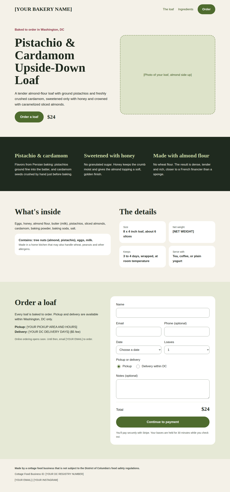
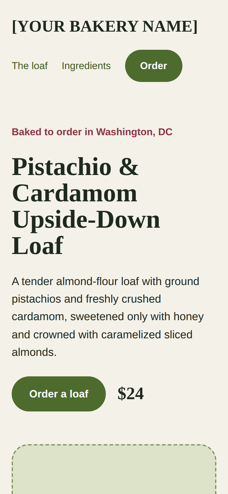
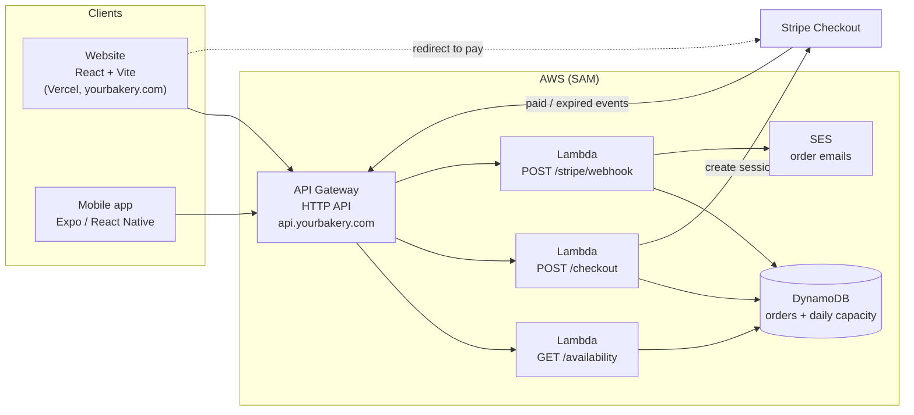

# Pistachio Loaf

A full-stack ordering system for a single-product home bakery in Washington, DC: a pistachio-cardamom upside-down loaf made with almond flour and honey.

**Live site:** [https://yourbakery.com](https://yourbakery.com) &nbsp;|&nbsp; **Instagram:** [@yourbakery](https://instagram.com/yourbakery)

<p>
  
  &nbsp;
  
</p>

## What it does

- Customers pick a bake date, quantity, and pickup or DC delivery, then pay through Stripe Checkout.
- The API enforces a daily baking capacity with an atomic DynamoDB counter, so a day can't be oversold even if two people check out at once.
- Loaves are held for 30 minutes during checkout. If payment isn't completed, a Stripe webhook releases them automatically.
- Paid orders trigger confirmation emails to the customer and the baker through Amazon SES.
- Delivery is validated to Washington, DC ZIP codes to match the DC cottage food permit.
- The website is an installable PWA. An Expo app shares the same API for iOS and Android.

## Architecture



### Order flow

1. `GET /availability` returns the price and remaining loaves for each upcoming bake day.
2. `POST /checkout` validates the order, atomically reserves capacity, saves a `pending` order, and returns a Stripe Checkout URL.
3. The customer pays on Stripe's hosted page. Card data never touches this system.
4. Stripe calls `POST /stripe/webhook`:
   - `checkout.session.completed` moves the order to `paid` and sends emails.
   - `checkout.session.expired` moves it to `expired` and releases the reserved loaves.
5. Status changes are conditional writes, so duplicate webhook deliveries are harmless.

### Data model (single DynamoDB table)

| PK | SK | Attributes |
|---|---|---|
| `DAY#2026-10-10` | `CAPACITY` | `booked` (loaves reserved that day) |
| `ORDER#<uuid>` | `ORDER` | customer, date, quantity, method, address, total, `status`, Stripe IDs |

## Tech stack

| Layer | Tools |
|---|---|
| Frontend | React 19, Vite, plain CSS, PWA manifest |
| Mobile | Expo, React Native, expo-web-browser |
| Backend | Node.js 20 on AWS Lambda (arm64), API Gateway HTTP API |
| Data | DynamoDB (on-demand, point-in-time recovery) |
| Payments | Stripe Checkout + signed webhooks |
| Email | Amazon SES |
| Infrastructure | AWS SAM (CloudFormation) |
| CI | GitHub Actions (API tests, web build) |
| Hosting | Vercel (web), custom domain via DNS |

## Repository layout

```
pistachio-loaf/
├── web/        React website (Vite)
├── api/        Serverless backend (AWS SAM template + Lambda handlers + tests)
├── mobile/     Expo app
├── docs/       Deployment guide and screenshots
└── .github/    CI workflow
```

## Run it locally

**Website** (runs in demo mode with sample dates until an API URL is set):

```bash
cd web
npm install
npm run dev            # http://localhost:5173
```

**API tests:**

```bash
cd api
npm install
npm test
```

**Mobile:** see [mobile/README.md](mobile/README.md).

## Deploy

Step-by-step instructions for AWS, Stripe, SES, Vercel, and the custom domain are in [docs/DEPLOY.md](docs/DEPLOY.md).

## Configuration

Shop details (name, pickup info, registry number, photo) are in [`web/src/site.js`](web/src/site.js). Price, delivery fee, daily capacity, lead time, and bake days are API parameters set at deploy time in [`api/template.yaml`](api/template.yaml).

Secrets (Stripe keys) are passed as deploy parameters and are never committed. See `.gitignore`.

## License

MIT
